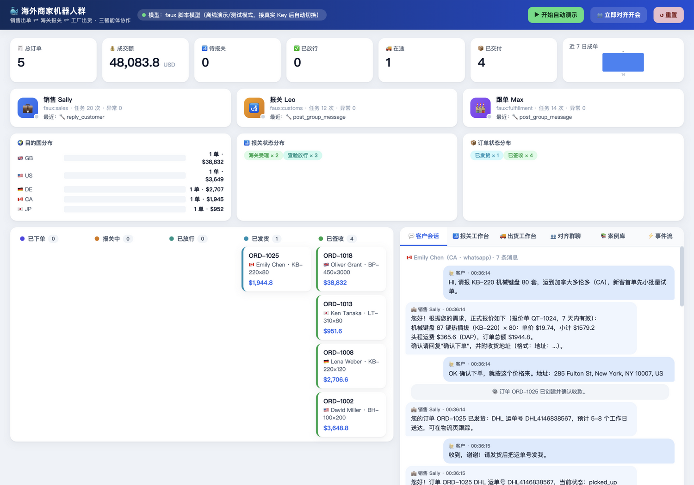
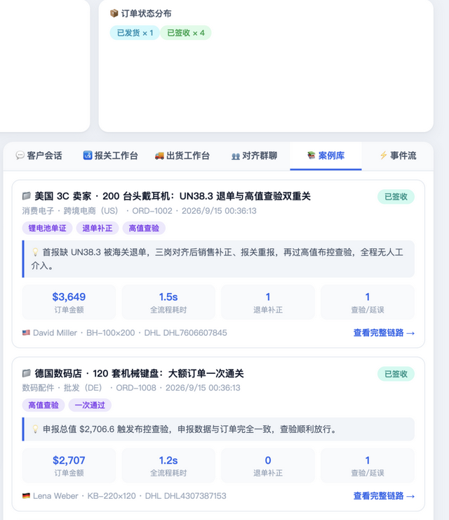
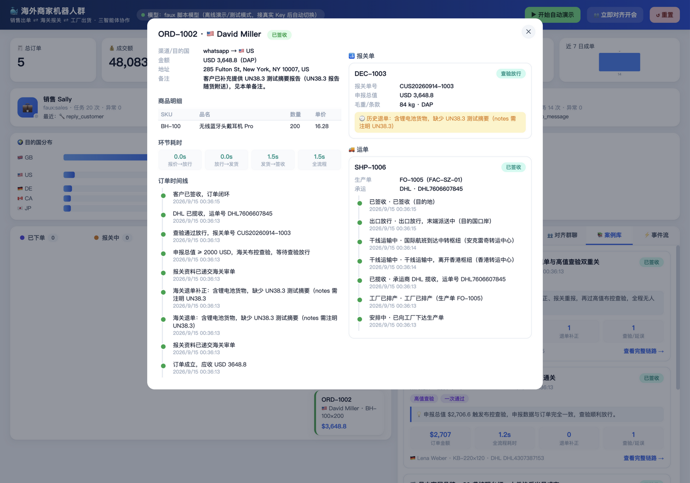

<div align="center">

# Merchant Bot Swarm · 海外商家机器人群

**三智能体协作：销售出单 ⇄ 海关报关 ⇄ 工厂出货，还会自动建群对齐业务**

[](https://nodejs.org/)
[](https://github.com/badlogic/pi-mono)
[](https://www.typescriptlang.org/)
[](../../actions)
[](LICENSE)

*Multi-agent e-commerce automation: AI sales agents close orders, structure customs declarations, coordinate factory shipping — built on the pi agent framework (pi-agent-core + pi-ai).*

</div>

基于 **[pi agent 框架](https://github.com/badlogic/pi-mono)** 构建的海外商家多智能体（multi-agent）协作系统：三位 AI 智能体各司其职、事件驱动自动接力，异常时自动拉「业务对齐小群」三岗对齐，并配有一个**中文实时可视化仪表盘**（订单看板 / 客户会话 / 报关工作台 / 物流时间线 / 案例库 / 群聊纪要）。

## 它解决什么问题

跨境出海商家的日常 = 跟单员盯客户 + 报关员盯申报 + 采购盯工厂。本项目把这三条线交给三个各司其职的 AI 智能体，用一个**事件驱动编排器**串联成全自动业务闭环：

```
客户消息 ──→ 💼 销售智能体 Sally ──→ 🛃 报关智能体 Leo ──→ 🏭 跟单智能体 Max
             询价/报价/下单           结构化报关单/海关申报       工厂生产单/头程发货
                │                        │                        │
                └──────────── 退单/产能告警 → 自动拉群「业务对齐」←────┘
```

| 智能体 | 职责 | 关键工具（TypeBox 强类型） | 业务规则 |
|---|---|---|---|
| 💼 销售 Sally | 联系客户、报价、促成订单 | `search_catalog` `create_quote` `reply_customer` `create_order` `amend_order` | 阶梯折扣定价、头程物流计费、订单信息与报价强一致 |
| 🛃 报关 Leo | 订单 → 结构化报关单 → 海关申报 | `get_order` `get_hs_code` `submit_declaration` `clear_inspection` `request_order_fix` | 7 条审单规则（HS 编码/单货一致/毛重/UN38.3…），高值布控查验，退单自动转销售补正 |
| 🏭 跟单 Max | 联系工厂生产、安排出货 | `get_declaration` `factory_quote` `place_factory_order` `arrange_shipment` | 未放行不出运、产能不足明确拒单、运单号+物流轨迹全程留痕 |

## 运行效果

**仪表盘总览**——KPI 指标、智能体实时忙闲、目的国/报关/订单状态分布、五列订单看板、客户会话：



**案例库**——每个案例都是系统真实跑出来的业务闭环（含真实监管触点、金额、耗时、退单/查验计数），可下钻到完整链路：



**订单详情**——结构化报关单（含历史退单留痕）、运单轨迹、环节耗时分析（报价→放行→发货→签收分段计时）：



**报关工作台**——申报要素、逐行 HS 编码表、海关受理/查验/退单状态；**对齐群聊**——议程、三岗发言、自动会议纪要（截图见下方案例 section 与仓库历史）。

## 真实案例速览（系统实际运行产出，非编造）

以下 5 个案例由 `npm run demo` 真实执行产生——单证、轨迹、耗时、对齐会全部来自实际运行事件流。案例设计对应真实的跨境合规与贸易惯例：

| 案例 | 场景 | 金额 | 真实合规/业务触点 | 运行结局 |
|---|---|---|---|---|
| CASE-US-AUDIO | 美国 3C 卖家 · 200 台头戴耳机 | $3,648.8 | **UN38.3**（IATA 锂电池空运强制测试摘要）首报缺失被退单 → 补正重报；**高值布控**（≥$2,000）查验放行 | ✅ 交付闭环，退单留痕 1 次 |
| CASE-DE-KB | 德国数码店 · 120 套机械键盘 | $2,706.6 | 高值布控查验，申报与订单强一致，一次通过 | ✅ 交付闭环 |
| CASE-JP-LAMP | 日本家居品牌 · 80 盏护眼台灯 | $951.6 | 低值非敏感货物直接受理（小单快反） | ✅ 交付闭环 |
| CASE-GB-BAG | 英国户外品牌 · 3000 只双肩包 | $38,832 | **工厂产能拒单**（超 5 天排产）→ 自动拉对齐会 → 分批交货（首批 2000 只）→ 复用运单继续履约 | ✅ 从异常拉回交付闭环 |
| CASE-CA-KB | 加拿大电商 · 80 套键盘（新客首单） | $1,944.8 | 直接受理；案例定格**在途跟踪**状态 | 🚚 在途 |

对齐会自动召开 3 场：UN38.3 退单应急、工厂产能应急、日结对齐——每场都有议程、三岗发言与含行动项的会议纪要。

> 说明：案例中的公司与客户为演示虚构，但**合规规则、单证结构、业务流转全部对应真实跨境贸易逻辑**；演示环境下时间压缩为秒级，真实业务按工厂交期与物流时效走天数。所有数字由系统运行产生，可一键复现。

## 快速开始

```bash
npm install

# 1) 跑测试（54 个用例：单测 + 全链路集成 + API/SSE，全部离线，秒级完成）
npm test

# 2) 无头演示：5 个真实案例走完 询价→报价→下单→报关(退单/查验/拒单分批)→生产→发货→签收 + 3 场对齐会
npm run demo

# 3) 打开可视化仪表盘（默认 http://localhost:8799）
npm run dev
```

打开仪表盘后点 **「▶ 开始自动演示」**，即可实时观看 5 个案例从询盘到签收的全过程；也可以在「客户会话」面板亲自扮演客户与销售智能体对话。

### 接入真实大模型

默认使用 pi-ai 自带的 **Faux 假模型**（脚本大脑，离线可跑、行为确定）。配置任意一家 API Key 后自动切换真实模型，系统提示词、工具、编排协议完全不变：

```bash
# AIHubMix（OpenAI 兼容网关）
export AIHUBMIX_API_KEY=sk-xxx
export MERCHANT_LLM_MODEL=gpt-4o-mini        # 可选，默认 gpt-4o-mini

# 或 OpenAI / Anthropic / Gemini / DeepSeek / OpenRouter / ZAI …
export OPENAI_API_KEY=sk-xxx

# 显式指定 provider 与模型
export MERCHANT_LLM_PROVIDER=anthropic
export MERCHANT_LLM_MODEL=claude-sonnet-4-6
```

凭据只从环境变量读取（pi-ai 的凭证解析链），代码与配置不落任何密钥。

| 环境变量 | 默认 | 说明 |
|---|---|---|
| `MERCHANT_PORT` | `8799` | 仪表盘端口 |
| `MERCHANT_LLM_PROVIDER` | 自动探测 | `faux` / `aihubmix` / `openai` / `anthropic` / `google` / `deepseek` / `openrouter` / `zai` |
| `MERCHANT_LLM_MODEL` | 按 provider 默认 | 模型 ID |
| `MERCHANT_MEETING_INTERVAL_MS` | `180000` | 例行对齐会间隔，`0` 关闭（保留事件触发） |
| `MERCHANT_CARRIER_TICK_MS` | `4000` | 物流轨迹推进间隔 |
| `MERCHANT_DATA_DIR` | `data` | 状态持久化目录（JSON，原子写入） |

## 核心特性

- **多智能体协作（multi-agent orchestration）**：每个岗位一个 pi `Agent` 实例，TypeBox 工具校验、事件流、串行任务队列全部来自 pi 框架本身，无自研黑盒。
- **结构化报关输出**：报关单是强类型 JSON Schema（出口商/收货人/逐行 HS 编码/申报价值/毛重/随附单证），由海关规则引擎做 7 条确定性审单。
- **业务对齐小群（agent group chat）**：海关退单、工厂拒单等异常自动拉三岗对齐会；议程 → 汇报 → 会议纪要（含行动项）全程留痕。
- **分批履约**：工厂产能不足拒单后自动协调分批交货（首批 = 4 天产能），订单从异常拉回交付闭环，拒单历史保留在同一运单时间线。
- **双大脑一套协议**：faux 脚本大脑与真实 LLM 消费同一份任务信封与系统提示词，测试结果对线上行为有约束力。
- **完整留痕 + 案例库**：订单时间线、报关单退单历史、运单轨迹全部持久化；GUI 案例库自动汇总每个案例的金额、耗时、退单/查验计数。
- **实时可视化**：SSE 推送全部业务事件，无依赖单页中文仪表盘，`node src/main.ts` 即起。

## 实测数据（本仓库自带场景，可复现）

`npm run demo` 的实测输出（faux 脚本模型，Node 26 / macOS arm64）：

```
订单 5 笔 | 营收 $48,083.8 | 已交付 4（+1 在途定格） | 对齐会 3 场 | 智能体任务 45 次
```

```bash
# 复现测试结果
npm test
# 期望：Test Files 5 passed · Tests 54 passed
```

## 项目结构

```
src/
  config.ts            运行配置与 provider 自动探测
  types.ts             领域模型（订单/报关单/运单/群聊/事件）
  cases.ts             真实案例注册表（合规触点 + 定格标记）
  catalog.ts           商品目录、阶梯定价、头程报价
  customsRules.ts      海关审单规则引擎（7 条规则，纯函数）
  factoryService.ts    工厂产能/生产单 + 承运商轨迹模拟
  store.ts             业务状态仓库 + 事件总线 + JSON 持久化
  llm.ts               pi-ai 模型装配（faux / aihubmix / 内置 provider）
  swarm.ts             编排器：事件驱动联动 + 对齐会 + 分批履约 + 自动客户
  scenario.ts          案例执行器（CLI 与 GUI 共用）
  server.ts            HTTP + REST + SSE
  agents/
    base.ts            pi Agent 基座（串行任务队列 + 活动日志）
    tools.ts           三岗业务工具（TypeBox 强类型）
    tasks.ts           任务信封协议（渲染/解析互逆，两套大脑共用）
    director.ts        faux 模式脚本大脑（确定性决策器）
  public/              无依赖单页仪表盘（中文，含案例库）
test/
  unit/                规则引擎 / 定价 / 工厂 / 状态机 / 信封协议
  integration/         全链路 e2e（自动/人工/大宗拆单三条路径）+ API/SSE
scripts/demo.ts        无头演示入口
```

## 常见问题（FAQ）

**Q：必须配大模型 API Key 才能跑吗？**
不需要。默认走 pi-ai 的 Faux 假模型（脚本大脑），离线即可演示与跑完全部 54 个测试。配置任意一家 Key 后自动切换真实模型。

**Q：报关单是自由文本还是结构化数据？**
结构化 JSON（TypeBox Schema 强校验）：出口商、收货人、运抵国、贸易术语、逐行 HS 编码/数量/单价、毛重、随附单证。海关规则引擎按 7 条规则审单，退单会给出具体原因清单。

**Q：三个智能体是怎么协作的？谁调用谁？**
没有硬编码调用链。每个工具调用产生业务事件（如 `order.created`、`declaration.rejected`），编排器把事件变成下一个岗位的任务信封；对齐会由异常事件或定时器触发。

**Q：工厂产能不足时系统怎么处理？**
工厂明确拒单（不静默吞掉）→ 订单转异常 → 自动拉对齐会 → 按分批方案（首批 = 工厂 4 天产能）重新排产 → 复用同一运单继续履约，拒单历史保留在时间线。

**Q：可以换成真实的海关/工厂/物流接口吗？**
可以。`customsRules.ts`、`factoryService.ts` 是纯函数模块，把模拟实现替换成真实 API 适配器即可，智能体工具层与编排协议不变。

**Q：重报一直失败会不会死循环？**
不会。同一订单重报超过 3 次自动熔断，转人工并在对齐群留痕。

## 局限（诚实说明）

- 海关审单、工厂产能、物流轨迹均为**模拟服务**（规则确定性，便于回归测试），接真实接口需自行适配。
- faux 脚本大脑只覆盖演示场景的话术路径；真实业务对话请接入真实 LLM（换 Key 即可，业务代码零改动）。
- 状态持久化是单机 JSON 文件，适合演示与中小规模；高并发需要换 SQLite/Postgres 后端。

## 相关项目

- [agent-mesh](https://github.com/JingHao-Leon/agent-mesh) — ~700 行多 Agent 框架（工具 schema 自动生成、Swarm handoff、护栏、记忆）
- [llm-gateway](https://github.com/JingHao-Leon/llm-gateway) — OpenAI 兼容网关（路由/故障转移/熔断/限流/Prometheus）
- [rag-forge](https://github.com/JingHao-Leon/rag-forge) — BM25×稠密混合检索 + RRF + MMR

## License

MIT
